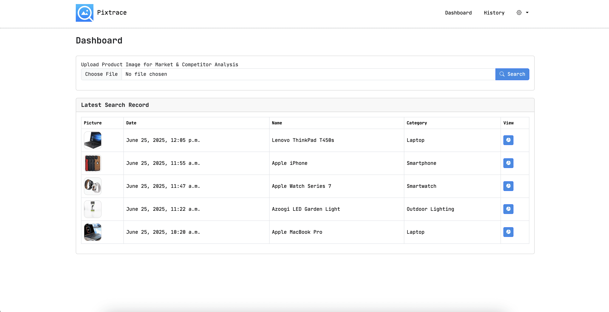

# Pixtrace

Project to process the image and generate the business analytics of the product.

1. Analyze the past market history of the product.
2. Predict the future market history of the product.
3. Competitor Analysis of the product.
4. List of product distributors.
5. Youtube review of the products

This project is based of Open AI api to process and analyze the product.
Where as youtube API to get the generic review of the product.

# System Requirement

- Python 3.13.5
- Django 5.2.3
- Mysql 9.2.0

# Installation

1. Create a Database.
2. Set the evironment variables
    - <b>PIXTRACE_DATABASE_NAME</b>  - <small>[ DB Name ]</small>
    - <b>PIXTRACE_DATABASE_USERNAME</b> <small>[ DB Username ]</small>
    - <b>PIXTRACE_DATABASE_PASSWORD</b> <small>[ DB Password ]</small>
    - <b>OPENAI_API_KEY</b> <small>[ ChatGPT API key ]</small>
    - <b>YOUTUBE_API_KEY</b> <small>[ Google API Key for Youtube]</small>
3. Run <i>Python manage.py migrate</i>
4. Run <i>Python manage.py createsuperuser</i>

# Preview

